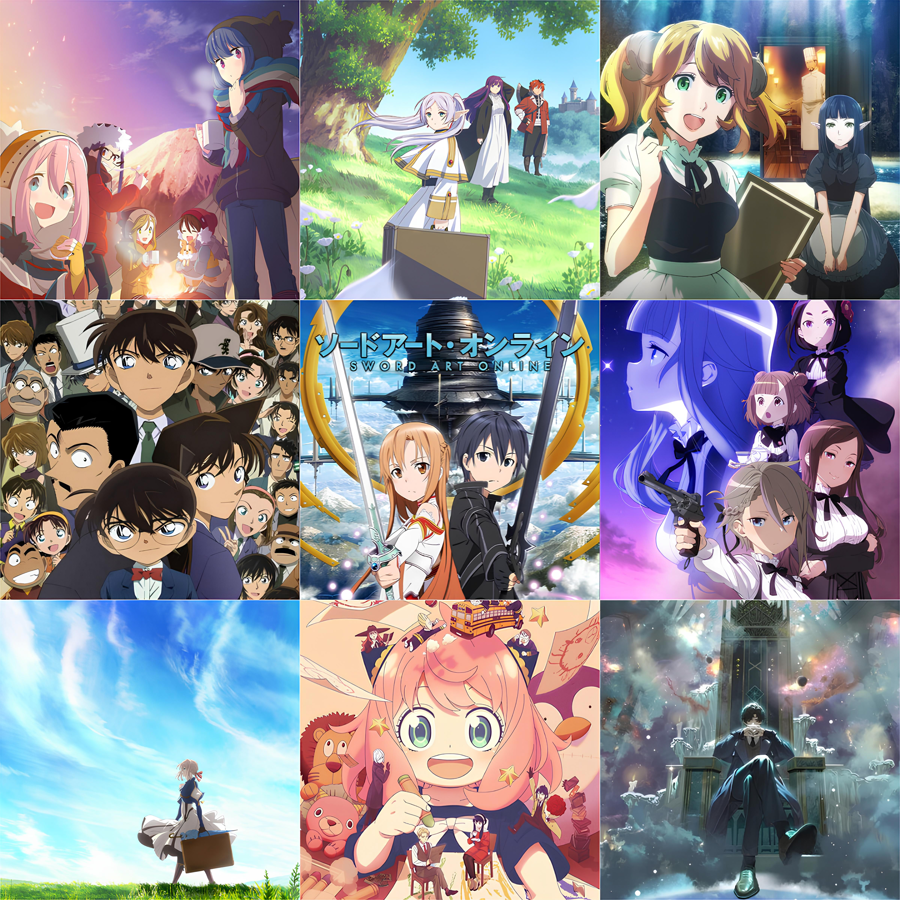
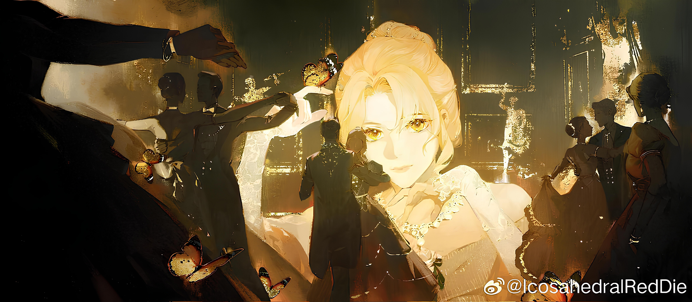

A 3x3 is a thing the anime community does. You pick nine shows — your favourites, your formative ones, the ones you'd press into someone's hands if you had to — and arrange them in a grid. It's part taste profile, part personality test, part argument starter.

Mine has been basically the same for a while now. That's how I know these nine are the real ones.

Here's what I picked, and why.

---

## The comfort trio

### Yuru Camp

I've already written [a whole piece about *Yuru Camp*](/posts/anime/yuru-camp), so I won't repeat myself too much. But it earns its place here simply because it is my all-time comfort show. The one I return to. The one that taught me, quietly and without ever saying it, that a life lived with attention to small things is a genuinely good life.

If you haven't seen it, go read that piece first. Then go watch the show.

### Spy x Family

*Spy x Family* is joy. Pure, uncomplicated joy.

A spy pretending to be a father. An assassin pretending to be a wife. A telepath pretending to be an ordinary child. A family pretending to be a family — and slowly, almost accidentally, becoming one anyway.

Yor is wonderful. Loid is wonderful. But it's Anya who makes the show. Her reactions, her schemes, her overflowing love for the family whose minds she can read — she is the heart of the whole thing. Every episode leaves me a little happier than when I started it. That's rarer than it sounds. That's worth nine grid spots if I had them.

### Restaurant to Another World

My favourite isekai. Technically a reverse isekai — a Western-style restaurant in modern-day Japan whose door opens once a week into a fantasy world, letting knights, elves, dragons, and demon lords wander in for lunch.

There's no conflict. No stakes. Just very good food described with real love, and strangers from completely different worlds sharing a table.

What I love about it is the structure. Each episode is a small story — someone finds the restaurant for the first time, falls completely for a dish, and carries that little piece of warmth back into their world. The restaurant is the nexus. Everything radiates outward from it. It scratches an itch I've never found scratched anywhere else.

---

## The ones that made me feel something

### Frieren: Beyond Journey's End

*Frieren* is an elf mage who helped defeat the demon king — after a decade-long journey — and then kept living long after her companions grew old and died. The show picks up years later, as she begins another journey with new, younger companions.

It's quiet. It's retrospective. And it is *devastating* in the most gentle way.

Frieren is ancient and powerful and she doesn't quite understand humans — how brief they are, how much weight a single decade holds for them. The show returns to this gap again and again, without forcing it, letting it land in its own time. And somewhere in watching her slowly learn to understand the people around her, you find yourself thinking differently about your own.

I came away from *Frieren* wanting to pay more attention. To people, to moments, to ordinary things that won't be there forever. That's the kind of effect only very good art has on you.

### Violet Evergarden

If you've seen *Violet Evergarden*, you already know what I'm about to say. If you haven't — episode 10.

A dying mother named Clara hires Violet for seven days to write letters. Her young daughter Anne watches, confused and quietly heartbroken, unable to understand why her mother is spending what little time she has left writing rather than being with her. Anne wants her mother. She wants those days back. She can't have them.

What Clara was writing were fifty letters — one for each of Anne's next fifty birthdays, to be delivered after she was gone.

The episode ends with Anne growing up. Receiving the letters. Her eighth birthday. Her eighteenth. Her wedding day. The birth of her child. Her mother's voice arriving across decades, full of love that didn't know how to run out.

I sat there completely undone. *Violet Evergarden* doesn't protect you from the emotions it's working with. It trusts you to sit with them. The animation is stunning, the music is unforgettable, and episode 10 is one of the most affecting pieces of television I've ever watched.

I haven't rewatched it because I'm not ready to. That's how I know it belongs here.

---

## The thrillers

### Detective Conan

There isn't much to explain here. It's *Detective Conan*.

A teenage genius detective accidentally shrunk into the body of a child, still solving cases while trying to take down the organisation that did this to him, while everyone around him remains impressively oblivious. Over a thousand episodes. Still going. Not a single complaint from me.

I love a good detective story — the deduction, the tight plotting, the long-form intrigue that rewards patience. *Detective Conan* is the ultimate expression of that love. It has been with me for years. It will probably be with me for many more.

### Princess Principal

A spy thriller set in a steampunk alternate-history London, where a group of girls operate as undercover agents in a world divided by a literal wall running through the city. It has style to spare — the aesthetic, the action, the period texture — but what makes it exceptional is the characters.

*(Spoiler!)* The reveal that Ange and the Princess swapped identities years ago — that the girl we know as the commoner spy grew up in the palace, and the girl on the throne grew up on the streets — recontextualises everything the show built before it. Both characters hit completely differently afterwards. It's the kind of twist that doesn't just surprise you. It deepens the whole thing.

That reveal is why *Princess Principal* made this list. Everything else is why it stayed.

---

## The one that changed my life

### Sword Art Online

My first anime. And more than that.

I know what you're thinking. I know the discourse. But *SAO* is on this list because of what it did to me — not just as an anime fan, but as a person.

It was the first time I felt genuinely invested in an animated world. The rules of it, the stakes, the people inside it. But somewhere in watching it, something else happened. The idea of a full-dive virtual world — a place as real as the real one, built from code — got into my head and wouldn't leave. And then there was Yui. An artificial intelligence who developed emotions, who loved, who was real in every way that mattered. I couldn't stop thinking about her.

*SAO* is what made me want to study computer science. I wanted to understand AI, to understand how something like Yui could exist. I wanted to understand VR and augmented reality — the worlds the show introduced me to. It wasn't just a gateway into anime. It pointed at something in me and said: *this is what you care about*. I listened.

I still love those characters deeply. Kirito, who carries too much alone. And Asuna — my favourite. She's warm and fierce and capable and devoted. Smart, wise, loyal, and loving — she is everything anybody could ever want in their life. She was my introduction to a certain kind of character I've spent years looking for since. None of them have quite matched her.

*SAO* will always have a place in this grid. Some stories don't just entertain you. They change the direction of your life.

---

## The cornerstone

### Lord of Mysteries

Everything else on this list I love deeply.

*Lord of Mysteries* is different.

It is my all-time favourite story across any medium — anime, manga, novel, film, anything. The cornerstone. The one I would place above everything else without hesitation.

*Lord of Mysteries* is a Chinese web novel with a donghua adaptation — the story of Klein Moretti, who finds himself transported into a dark, Victorian-era world layered with cosmic horror, secret societies, ancient gods, and one of the most intricate and rewarding magic systems ever constructed. Think Lovecraft meets Sherlock Holmes, with the world-building depth of Fullmetal Alchemist and the long-game patience of the very best epic fantasy.

It is dense. It is long. It rewards attention in ways that are hard to describe without underselling. The world is vast and strange and internally consistent in a way that feels almost miraculous. The plot threads you forget about in volume two pay off in volume six. Klein — cautious, sharp, quietly funny, doing his best to survive in a world that is much larger and stranger than he understood — is one of my favourite protagonists ever written.

I love it enough that I moderate the *Lord of Mysteries* subreddit. I also run the largest *Lord of Mysteries* Facebook group.

That should tell you everything about how I feel about it.

If you're going to trust me on one recommendation from this entire list — one thing to go and find and give your full attention to — start here.

