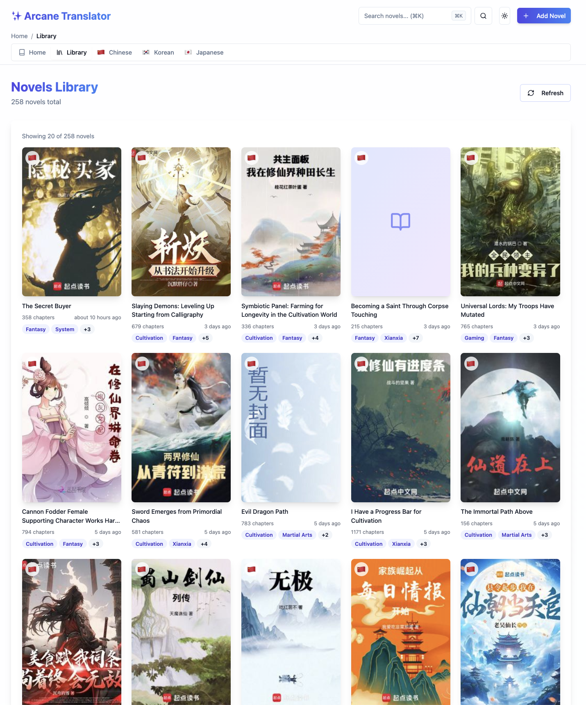
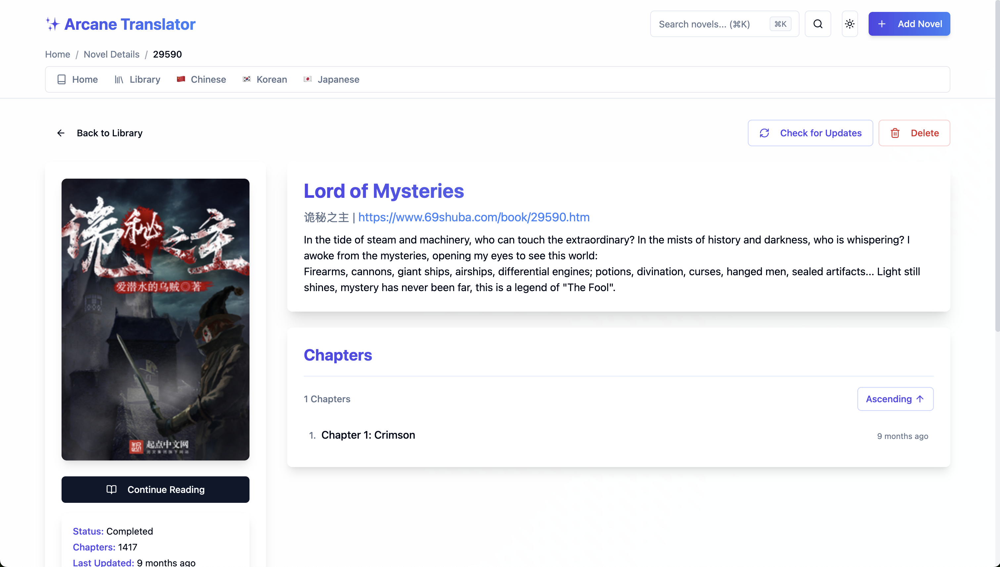
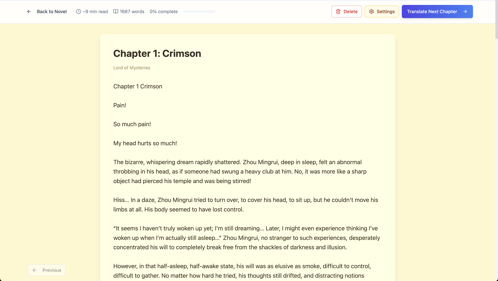

There's a specific kind of frustration that only web novel readers know.

You find something great. An xianxia with cultivation that actually has internal logic, a wuxia with a protagonist who earns his power rather than stumbling into it, a xuanhuan with world-building that rewards you for paying attention. You read the available translated chapters in two days, reach the end, and then check the source — 900 more chapters sitting there in Chinese. The fan translation, if one exists at all, updates once a month if you're lucky.

That frustration is where Arcane Translator started.

## The itch

I read a lot of Chinese web novels. Xianxia primarily, but wuxia and xuanhuan too depending on what I'm in the mood for. I also pick up Japanese and Korean ones when something interesting comes up. The translation ecosystem for all of these is patchy — some novels get excellent fan translations, some get machine-translated garbage, and some just never get touched because they don't have a big enough international following.

The ones that fall through the cracks tend to be exactly the kind I want to read: niche, slightly weird, not obviously marketable to a Western audience.

I'd tried the usual workarounds. Browser extensions, copy-pasting into Google Translate, DeepL. They work, technically, but reading that way is miserable. You lose all formatting. You have to do it chapter by chapter, paragraph by paragraph. Cultivation terms get garbled. Names become inconsistent halfway through. The experience is bad enough that you'd rather just wait for a proper translation — except there often isn't one coming.

So I did what any reasonable software engineer would do: I spent a month building a first version, then a year quietly using it, breaking it, fixing it, and making it actually good.

## What it actually is

Arcane Translator is a local web app — React frontend, Go backend, SQLite database — that scrapes novels from source sites, sends the content through an AI model for translation, and presents everything in a clean reading interface.

You give it a URL from a supported source (a handful of Chinese, Japanese, and Korean novel platforms), it pulls the metadata and chapter list, and adds it to your local library. When you open a chapter, it fetches the raw text, runs it through translation, and shows you the result. Reading progress is tracked. The library is yours, stored locally.

No subscription. No cloud sync. No data going anywhere you didn't put it.

## The tech, briefly

The backend is Go. Concurrent scraping is exactly the kind of thing Go handles without complaint — pulling multiple chapters in parallel, managing rate limits, retrying failed requests — and the goroutine-based architecture kept all of that clean without much ceremony.

The AI translation layer is pluggable. I've wired up a few different backends over the course of the project, and the interface makes it easy to swap them in and out. Different models have different strengths — some handle classical cultivation terminology better, some are more consistent with name transliterations across long chapters — and having the flexibility to switch depending on the source material has been genuinely useful.

Translation quality for xianxia and wuxia specifically is better than I expected going in. The genre has a very specific vocabulary — dao, qi, realm names, martial techniques — and a good model handles it consistently once you prompt it right. Getting that prompting right was probably 30% of the year I spent refining things.

The database is SQLite, which is the right call for a local-first tool. No server, no migrations in production, no connection pooling to think about.

The frontend is React with shadcn/ui components. Nothing clever — I wanted a reading experience that stayed out of the way. The kind of interface you build because you're going to be staring at it for hours at a time, so it had better not annoy you.

## How it actually got built

The first version took about a month. It was rough — one scraper, one AI backend, no library management, barely any error handling — but it worked well enough that I could actually use it to read. And then I did.

That's where the real development happened. A year of using the thing myself, every day, on novels I actually cared about. When a scraper broke because a source site changed its markup overnight, I fixed it. When the translation was inconsistently handling a character's name across chapters, I figured out why and fixed the prompt. When the reading experience had some friction I kept bumping into, I removed it.

It's a better way to build something than sitting down and trying to anticipate what problems you'll have. You can't anticipate them. You find them by using the thing.

The scraping layer, specifically, has been the most maintenance-intensive part. Novel websites are not built with scrapers in mind, their HTML is inconsistent, and they add bot detection periodically. I've written scrapers for eight different sources at this point. I would not say I enjoy this part.

## Was it worth it?

Yes, unambiguously.

Not because it's impressive engineering. It isn't — it's a scraper, an AI API call, and a reading interface. None of those individually are hard. It's worth it because I use it constantly, it solves a problem I actually had, and the year of living with it produced something that genuinely works the way I want it to.

There's also something satisfying about a tool that is exactly what you wanted and nothing else. It does what I need, on my machine, under my control.

The code is on [GitHub](https://github.com/DebanganThakuria/arcane-translator) if you want to take a look. It's not polished enough to recommend to non-technical people yet, but if you can run a Go binary and an npm dev server you should be able to get it going.

And if you have novel recommendations I haven't heard of — my socials are on the [home page](/). Please send them. The backlog is never long enough.
